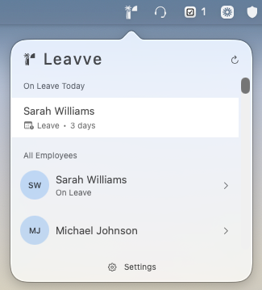
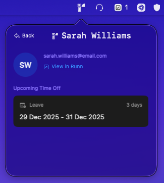

# Leavve

A macOS menubar app for tracking employee leave from the Runn API.




## Overview

Leavve is a native macOS menubar application that integrates with [Runn](https://www.runn.io/) to provide quick visibility into your team's time-off schedules. Built with SwiftUI and modern macOS development patterns, it lives in your menubar for instant access to leave information.

## Features

- **Menubar Integration** - Lives in your macOS menubar, accessible with a single click
- **Today's Leave** - See at a glance who's on leave today
- **Employee Directory** - Browse all employees and their upcoming time-offs
- **Employee Details** - View detailed time-off schedules for individual team members
- **Auto-Sync** - Automatically refreshes data at a scheduled time (default 7:00 AM)
- **Runn API Integration** - Real-time sync with your Runn workspace
- **Light & Dark Mode** - Automatically adapts to your macOS appearance settings
- **Persistent Settings** - Saves your API key and preferences locally
- **No Dock Icon** - Stays out of the way as a menubar-only app

## Requirements

- macOS 12.0 (Monterey) or later
- A [Runn](https://www.runn.io/) account with API access
- Xcode 14.0 or later (for building from source)

## Installation

### From Source

1. Clone this repository:
   ```bash
   git clone https://github.com/yourusername/leavve.git
   cd leavve
   ```

2. Open the project in Xcode:
   ```bash
   open Leavve.xcodeproj
   ```

3. Build and run the project (⌘R)

4. The app will appear in your menubar

## Setup

### Getting Your Runn API Key

1. Log in to your [Runn](https://www.runn.io/) account
2. Navigate to Settings → Integrations → API
3. Generate a new API key
4. Copy the key

### Configuring Leavve

1. Click the Leavve icon in your menubar
2. Swipe or navigate to the Settings page (rightmost page)
3. Paste your Runn API key
4. Configure your preferred auto-refresh time (optional)
5. Click "Refresh Data" to load your team's information

## Usage

### Viewing Today's Leave

Click the Leavve menubar icon to open the popover. The home page shows:
- A list of employees currently on leave today
- The full employee directory with leave indicators
- A refresh button to manually update data

### Viewing Employee Details

Click on any employee to see their upcoming time-offs, including:
- Leave dates (start and end)
- Type of leave
- Duration

### Right-Click Menu

Right-click the menubar icon for quick actions:
- About - View app information
- Quit - Exit the application

### Auto-Refresh

By default, Leavve automatically syncs with Runn at 7:00 AM daily. You can customize this time in Settings or disable auto-refresh entirely.

## Architecture

Leavve is built with:
- **SwiftUI** - Modern declarative UI framework
- **AppKit** - Traditional macOS menubar app foundation
- **Combine** - Reactive state management
- **Async/Await** - Modern Swift concurrency for API calls

The app uses an AppDelegate-centric architecture with SwiftUI views hosted in an NSPopover. It features a three-page interface with swipe navigation and integrates seamlessly with macOS menubar conventions.

For detailed architectural documentation, see [CLAUDE.md](CLAUDE.md).

## Development

### Building

```bash
xcodebuild -project Leavve.xcodeproj -scheme Leavve build
```

### Running

```bash
open Leavve.xcodeproj
# Then press ⌘R in Xcode
```

### Project Structure

```
Leavve/
├── AppDelegate.swift              # Main app controller
├── AppDelegate+Functions.swift    # Menubar interactions
├── Models/                        # Data models
├── Services/                      # API and storage services
├── State/                         # App state management
├── Views/                         # SwiftUI views
├── Components/                    # Reusable UI components
└── Assets.xcassets/              # Images and icons
```

See [CLAUDE.md](CLAUDE.md) for comprehensive development documentation.

## Privacy & Security

- All data is fetched directly from the Runn API
- Your API key is stored locally in macOS UserDefaults
- The app requires network access (enabled in entitlements)
- No analytics or tracking
- No third-party services beyond Runn API

## Troubleshooting

### App not appearing in menubar
Check that the app is running. Since it has no dock icon (LSUIElement=true), look for it in Activity Monitor if unsure.

### "Failed to load data" error
- Verify your Runn API key is correct in Settings
- Check your internet connection
- Ensure your Runn account has API access enabled

### Popover appears in wrong position
This can happen on multi-monitor setups. Try quitting and restarting the app.

### Auto-refresh not working
- Check that the app is still running
- Verify the scheduled time in Settings
- Make sure your Mac is awake at the scheduled time

## Contributing

Contributions are welcome! Please feel free to submit issues or pull requests.

## License

This project is licensed under the MIT License. See [LICENSE](LICENSE) for details.

Original menubar template: Copyright (c) 2022 Steven J. Selcuk

## Acknowledgments

- Built with [Runn API](https://www.runn.io/)
- Icons and assets created for this project
- Inspired by the need for better team leave visibility

## Support

For issues, questions, or feature requests, please open an issue on GitHub.

---

Made with SwiftUI for macOS
